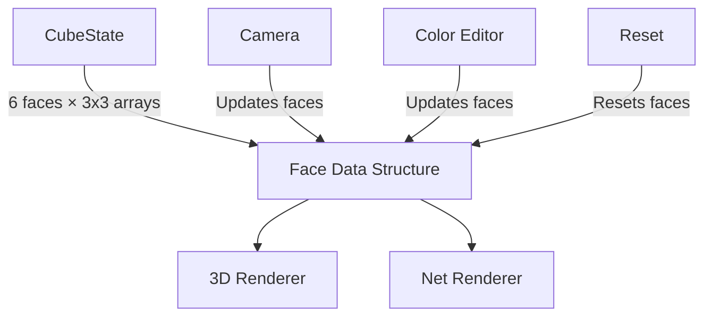
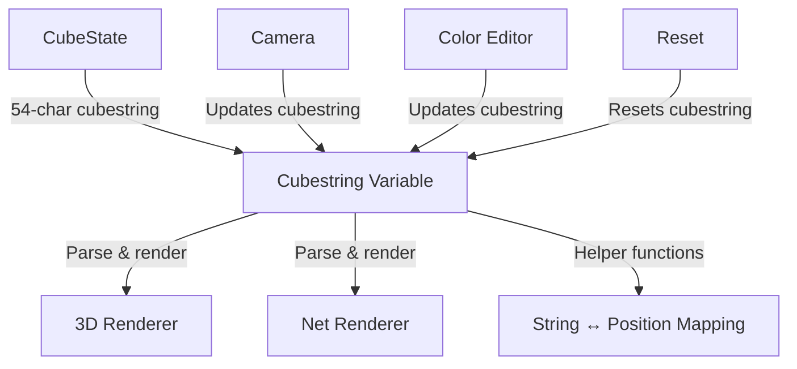

# Design Document

## Overview

This design document outlines the refactoring of the Rubik's cube application to use a single cubestring variable as the source of truth for all cube state. The current implementation uses a face-based data structure with 3x3 arrays for each face. The refactored design will use a 54-character string (using u, l, t, d, f, b notation) as the primary state representation, with both the 3D and net views deriving their rendering from this string.

This architectural simplification will:
- Reduce state management complexity
- Ensure consistency between views
- Simplify camera and color editing operations
- Make state serialization and backend integration more straightforward
- Align with standard Rubik's cube notation used by solving algorithms

## Architecture

### Current Architecture



### New Architecture



### Technology Stack

- **Frontend Framework**: Vanilla JavaScript (ES6+) - unchanged
- **State Management**: Single cubestring variable with helper functions
- **Rendering**: CSS 3D Transforms and CSS Grid - unchanged
- **Data Format**: 54-character string using u,l,t,d,f,b notation

## Components and Interfaces

### 1. Cubestring Format Specification

The cubestring will be a 54-character string representing all stickers on the cube using the **backend's COLOR_TO_CUBE mapping format** from config.py.

**Format**: `UUUUUUUUURRRRRRRRRFFFFFFFFFDDDDDDDDDLLLLLLLLLBBBBBBBBB`

**Face Order**: U (up), R (right), F (front), D (down), L (left), B (back)

**Character Mapping** (from backend's COLOR_TO_CUBE):
- `U` = Up face color (White in solved state)
- `R` = Right face color (Red in solved state)
- `F` = Front face color (Green in solved state)
- `D` = Down face color (Yellow in solved state)
- `L` = Left face color (Orange in solved state)
- `B` = Back face color (Blue in solved state)

**Position Mapping** (0-indexed):
- Positions 0-8: Up face (row-major order: top-left to bottom-right)
- Positions 9-17: Right face
- Positions 18-26: Front face
- Positions 27-35: Down face
- Positions 36-44: Left face
- Positions 45-53: Back face

**Example Solved Cube**:
```
UUUUUUUUURRRRRRRRRFFFFFFFFFDDDDDDDDDLLLLLLLLLBBBBBBBBB
```

**Important**: This format matches the backend's config.py COLOR_TO_CUBE mapping exactly, ensuring seamless integration with the camera program and backend validation services.

### 2. Refactored CubeState Class

**Purpose**: Manage cube state using a single cubestring variable with helper functions for conversion and access.

**Key Changes**:
- Replace `this.faces` object with `this.cubestring` string
- Add helper functions to convert between string positions and face/sticker coordinates
- Maintain backward compatibility with existing API where possible
- Update import/export functions to work with cubestring

**Interface**:
```javascript
class CubeState {
  constructor()
  
  // Core state management
  getCubestring()                           // Get the full cubestring
  setCubestring(cubestring)                 // Set the full cubestring
  
  // Position mapping helpers
  getStickerFromString(position)            // Get sticker color at string position (0-53)
  setStickerInString(position, color)       // Set sticker color at string position
  stringPositionToFaceCoords(position)      // Convert string position to {face, row, col}
  faceCoordsToStringPosition(face, row, col) // Convert face coords to string position
  
  // Backward compatible API (delegates to cubestring)
  getFaceColors(facePosition)               // Returns 3x3 array from cubestring
  setFaceColors(facePosition, colors)       // Updates cubestring from 3x3 array
  getStickerColor(facePosition, row, col)   // Gets color from cubestring
  setStickerColor(facePosition, row, col, color) // Updates cubestring
  
  // Validation
  isValidCubestring(cubestring)             // Validate cubestring format
  isValidState()                            // Check if cubestring represents valid cube
  
  // State operations
  reset()                                   // Reset to solved cubestring
  getState()                                // Export state including cubestring
  setState(state)                           // Import state including cubestring
  
  // Change notifications (unchanged)
  addChangeListener(callback)
  notifyChange(changeType, data)
}
```

### 3. Refactored CubeRenderer Class

**Purpose**: Render cube visualization from cubestring.

**Key Changes**:
- Update `create3DFace()` to read from cubestring via helper functions
- Update `createNetFace()` to read from cubestring via helper functions
- Update color update methods to work with cubestring positions
- Maintain existing visual appearance and interactions

**Interface** (mostly unchanged):
```javascript
class CubeRenderer {
  constructor(containerId, cubeState)
  
  // Rendering methods (updated internally to use cubestring)
  render3DView()
  renderNetView()
  create3DFace(facePosition)
  createNetFace(facePosition)
  
  // Update methods (updated to work with cubestring)
  updateFaceColors(facePosition, colors)
  updateStickerColor(facePosition, row, col, color)
  
  // Interaction methods (unchanged)
  enableInteraction()
  disableInteraction()
  handleStickerClick(event, facePosition, row, col)
  
  // State change handler (updated to handle cubestring changes)
  handleStateChange(event)
}
```

### 4. Refactored Camera Capture

**Purpose**: Update cubestring when camera detects colors.

**Key Changes**:
- Update `applyDetectedColors()` to modify cubestring directly
- Convert detected colors to cubestring notation
- Update cubestring in bulk for better performance

**Interface** (mostly unchanged):
```javascript
class CameraCapture {
  constructor(cubeState)
  
  // Camera methods (unchanged)
  requestCameraAccess()
  openCameraInterface()
  captureImageFromVideo()
  detectColorsFromImage(imageData, face)
  
  // Updated to work with cubestring
  applyDetectedColors(detectedColors, face)
  
  // Helper methods
  convertColorsToCubestring(colors, face)  // New helper
  closeCamera()
}
```

### 5. Color Editor Integration

**Purpose**: Update cubestring when user edits colors manually.

**Key Changes**:
- Update color application to modify cubestring
- Use cubeState helper functions for position mapping
- Maintain existing UI and interaction patterns

**Interface**:
```javascript
class ColorEditor {
  constructor(cubeState, cubeRenderer)
  
  // Color editing (updated to work with cubestring)
  selectColor(color)
  selectFaceSticker(facePosition, stickerIndex)
  updateColor()                             // Updates cubestring
  
  // UI methods (unchanged)
  showColorPalette()
  enableEditMode()
  disableEditMode()
}
```

## Data Models

### Cubestring Model

```javascript
{
  cubestring: "UUUUUUUUURRRRRRRRRFFFFFFFFFDDDDDDDDDLLLLLLLLLBBBBBBBBB", // 54 characters
  format: "URFdlb",                    // Face order (matches backend)
  notation: {
    U: "up/white",
    R: "right/red",
    F: "front/green",
    D: "down/yellow",
    L: "left/orange",
    B: "back/blue"
  },
  backendCompatible: true               // Uses backend's COLOR_TO_CUBE mapping
}
```

### Position Mapping Model

```javascript
{
  stringPosition: 0-53,                // Position in cubestring
  face: "front" | "back" | "left" | "right" | "top" | "bottom",
  row: 0-2,                            // Row within face
  col: 0-2,                            // Column within face
  color: "U" | "R" | "F" | "D" | "L" | "B"  // Backend COLOR_TO_CUBE notation
}
```

### Face Range Model

```javascript
{
  up: { start: 0, end: 9 },      // U face (White)
  right: { start: 9, end: 18 },  // R face (Red)
  front: { start: 18, end: 27 }, // F face (Green)
  down: { start: 27, end: 36 },  // D face (Yellow)
  left: { start: 36, end: 45 },  // L face (Orange)
  back: { start: 45, end: 54 }   // B face (Blue)
}
// Note: Matches backend's COLOR_TO_CUBE mapping order
```

### State Model (Updated)

```javascript
{
  cubestring: "UUUUUUUUU...",          // Primary state (backend format)
  currentView: "3d" | "net",
  editMode: boolean,
  metadata: {
    lastModified: timestamp,
    isValid: boolean,
    isSolved: boolean,
    backendCompatible: true             // Uses backend COLOR_TO_CUBE mapping
  }
}
```

## Implementation Strategy

### Phase 1: Add Cubestring Support

1. Add `cubestring` property to CubeState
2. Implement helper functions for position mapping
3. Implement cubestring validation
4. Keep existing face-based structure temporarily for backward compatibility

### Phase 2: Update State Management

1. Make cubestring the primary state
2. Update getFaceColors/setFaceColors to derive from cubestring
3. Update getStickerColor/setStickerColor to use cubestring
4. Update reset() to work with cubestring
5. Update import/export functions

### Phase 3: Update Renderers

1. Update CubeRenderer to read from cubestring via helper functions
2. Update 3D face rendering
3. Update net face rendering
4. Update color update animations

### Phase 4: Update Input Methods

1. Update camera capture to modify cubestring
2. Update color editor to modify cubestring
3. Update reset button integration
4. Test all input methods

### Phase 5: Cleanup and Optimization

1. Remove deprecated face-based internal storage
2. Optimize cubestring operations
3. Add comprehensive validation
4. Update documentation

## Helper Functions Design

### Position Mapping Functions

```javascript
/**
 * Convert string position to face coordinates
 * @param {number} position - Position in cubestring (0-53)
 * @returns {Object} {face, row, col}
 */
stringPositionToFaceCoords(position) {
  // Determine which face based on position ranges
  // Calculate row and col within that face
  // Return {face: 'front', row: 1, col: 2}
}

/**
 * Convert face coordinates to string position
 * @param {string} face - Face name
 * @param {number} row - Row (0-2)
 * @param {number} col - Column (0-2)
 * @returns {number} Position in cubestring (0-53)
 */
faceCoordsToStringPosition(face, row, col) {
  // Get face start position
  // Calculate offset: row * 3 + col
  // Return start + offset
}

/**
 * Extract face substring from cubestring
 * @param {string} cubestring - Full cubestring
 * @param {string} face - Face name
 * @returns {string} 9-character face substring
 */
extractFaceString(cubestring, face) {
  // Get face range
  // Return substring
}

/**
 * Update face in cubestring
 * @param {string} cubestring - Current cubestring
 * @param {string} face - Face name
 * @param {string} faceString - 9-character face string
 * @returns {string} Updated cubestring
 */
updateFaceInString(cubestring, face, faceString) {
  // Get face range
  // Replace substring
  // Return new cubestring
}
```

### Conversion Functions

```javascript
/**
 * Convert 3x3 color array to 9-character string
 * @param {Array} colorArray - 3x3 array of colors
 * @returns {string} 9-character string
 */
colorArrayToString(colorArray) {
  // Flatten array row by row
  // Join into string
}

/**
 * Convert 9-character string to 3x3 color array
 * @param {string} faceString - 9-character string
 * @returns {Array} 3x3 array of colors
 */
stringToColorArray(faceString) {
  // Split into rows of 3
  // Return 2D array
}

/**
 * Validate backend color notation
 * @param {string} backendColor - Backend color (U, R, F, D, L, B)
 * @returns {boolean} Whether the color is valid backend notation
 */
isValidBackendColor(backendColor) {
  // Validate that color matches backend COLOR_TO_CUBE mapping
  // Valid colors: U, R, F, D, L, B
}
```

## Error Handling

### Cubestring Validation Errors

1. **Invalid Length**
   - Detect if cubestring is not exactly 54 characters
   - Provide clear error message
   - Prevent state corruption

2. **Invalid Characters**
   - Validate that all characters are valid (u, l, t, d, f, b)
   - Identify invalid characters and positions
   - Suggest corrections

3. **Invalid Color Distribution**
   - Check that each color appears exactly 9 times
   - Report color count discrepancies
   - Offer auto-correction if possible

### Position Mapping Errors

1. **Out of Range Position**
   - Validate position is 0-53
   - Throw descriptive error
   - Prevent array access errors

2. **Invalid Face Coordinates**
   - Validate face name is valid
   - Validate row/col are 0-2
   - Provide helpful error messages

### Backward Compatibility Errors

1. **Legacy API Usage**
   - Maintain support for face-based API
   - Log deprecation warnings if needed
   - Ensure smooth transition

## Testing Strategy

### Unit Testing

1. **Cubestring Operations**
   - Test cubestring initialization
   - Test position mapping functions
   - Test conversion functions
   - Test validation functions

2. **State Management**
   - Test getCubestring/setCubestring
   - Test backward compatible API
   - Test state import/export
   - Test reset functionality

3. **Helper Functions**
   - Test stringPositionToFaceCoords
   - Test faceCoordsToStringPosition
   - Test extractFaceString
   - Test updateFaceInString
   - Test colorArrayToString
   - Test stringToColorArray

### Integration Testing

1. **Renderer Integration**
   - Test 3D view renders correctly from cubestring
   - Test net view renders correctly from cubestring
   - Test view switching preserves cubestring
   - Test color updates reflect in both views

2. **Camera Integration**
   - Test camera updates cubestring correctly
   - Test detected colors map to correct positions
   - Test multiple face captures work correctly

3. **Color Editor Integration**
   - Test manual edits update cubestring
   - Test edits reflect in both views
   - Test undo/redo with cubestring

4. **End-to-End Workflows**
   - Test complete camera capture workflow
   - Test complete manual editing workflow
   - Test reset after various operations
   - Test view switching during editing

### Performance Testing

1. **Rendering Performance**
   - Measure render time with cubestring
   - Compare with previous face-based approach
   - Ensure no performance regression

2. **State Update Performance**
   - Measure cubestring update operations
   - Test bulk updates (e.g., full face)
   - Test single sticker updates

3. **Memory Usage**
   - Compare memory footprint
   - Verify string operations don't cause memory leaks

## Migration Path

### Backward Compatibility

The refactoring will maintain backward compatibility by:

1. **Keeping Existing API**: Methods like `getFaceColors()` and `setStickerColor()` will continue to work, but internally use cubestring
2. **Transparent Conversion**: Automatic conversion between face arrays and cubestring
3. **No Breaking Changes**: External components don't need immediate updates
4. **Gradual Migration**: Can update components one at a time

### Migration Steps for Developers

1. **Phase 1**: Cubestring added alongside existing structure
2. **Phase 2**: Internal operations switch to cubestring
3. **Phase 3**: External API remains unchanged but uses cubestring internally
4. **Phase 4**: Optional: New cubestring-native API available
5. **Phase 5**: Cleanup of deprecated internal structures

## Performance Considerations

### Optimization Strategies

1. **String Immutability**: Use string slicing and concatenation efficiently
2. **Caching**: Cache position mappings if needed
3. **Bulk Updates**: Provide methods for updating multiple positions at once
4. **Lazy Conversion**: Only convert to face arrays when explicitly requested

### Expected Performance Impact

- **Memory**: Reduced (54 bytes vs 6 × 9 × object overhead)
- **State Updates**: Similar or faster (direct string manipulation)
- **Rendering**: No change (same rendering logic)
- **Serialization**: Faster (string is already serialized)

## Documentation Updates

### Code Documentation

1. Add comprehensive JSDoc comments for all new functions
2. Document cubestring format specification
3. Provide examples of position mapping
4. Document migration guide for future developers

### User-Facing Documentation

1. No user-facing changes (transparent refactoring)
2. Maintain existing user experience
3. No new UI or interactions required

## Benefits of This Refactoring

1. **Simplified State Management**: Single source of truth
2. **Better Performance**: Reduced memory and faster serialization
3. **Easier Backend Integration**: String format matches backend expectations
4. **Standard Notation**: Aligns with Rubik's cube solving algorithms
5. **Reduced Complexity**: Fewer data structures to maintain
6. **Easier Testing**: String comparison is simpler than deep object comparison
7. **Better Debugging**: Easy to log and inspect cube state
8. **Future-Proof**: Standard format for potential solver integration
