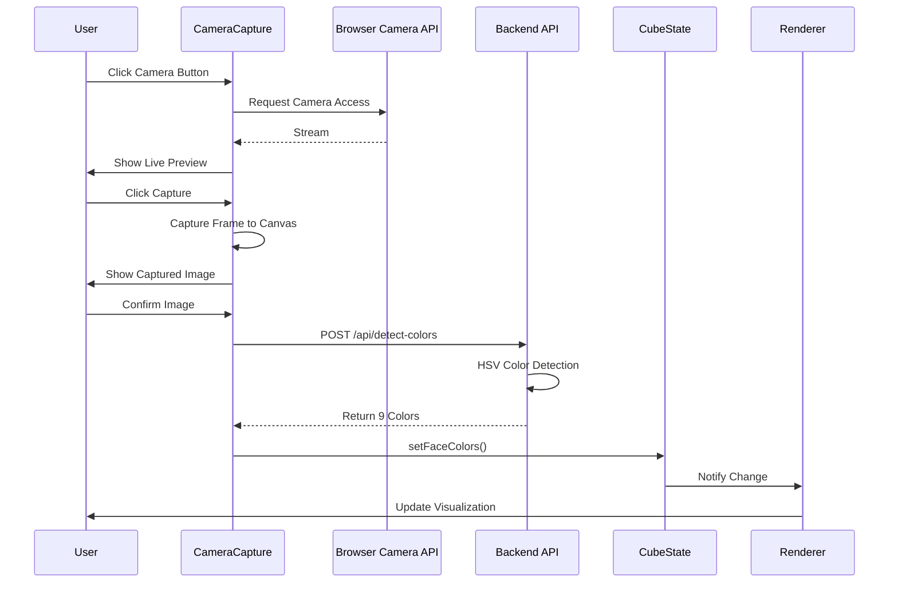

# Design Document: Frontend Camera Capture

## Overview

This design transforms the camera capture workflow from a backend-controlled process to a frontend-controlled process. The new architecture captures images directly in the browser using the Web Camera API, then sends those images to the backend for color extraction only. This provides better user experience with real-time feedback, eliminates the need to launch external programs, and gives users more control over the capture process.

### Key Design Principles

1. **Frontend-First**: Camera access and image capture happen entirely in the browser
2. **Backend as Service**: Backend provides color detection as a stateless API service
3. **Progressive Enhancement**: Graceful degradation when camera or backend is unavailable
4. **Minimal Disruption**: Leverage existing `CubeState` and rendering infrastructure
5. **User Control**: Users control when to capture, retake, and confirm images

## Architecture

### High-Level Architecture

```mermaid
graph TB
    subgraph "Frontend (Browser)"
        UI[User Interface]
        CC[CameraCapture Class]
        CS[CubeState Class]
        CR[CubeRenderer]
        
        UI -->|User Actions| CC
        CC -->|Update State| CS
        CS -->|Notify Changes| CR
        CR -->|Render| UI
    end
    
    subgraph "Backend (Flask API)"
        API[/api/detect-colors]
        HSV[HSV Color Detection]
        
        API --> HSV
    end
    
    CC -->|POST Image| API
    API -->|Return Colors| CC
    
    style CC fill:#e1f5ff
    style API fill:#fff4e1
```

### Component Interaction Flow



## Components and Interfaces

### 1. CameraCapture Class (Frontend)

**Location**: `scripts/camera-capture.js`

**Responsibilities**:
- Request and manage camera access via Web Camera API
- Display live video preview with visual guides
- Capture still images from video stream
- Send images to backend for color detection
- Apply detected colors to cube state
- Handle errors and provide user feedback

**Key Methods**:

```javascript
class CameraCapture {
    constructor(cubeState)
    
    // Camera Access
    async requestCameraAccess()
    async openCameraInterface()
    closeCamera()
    
    // Image Capture
    captureImageFromVideo()
    async handleCaptureClick()
    
    // Backend Communication
    async detectColorsFromImage(imageData, face)
    applyDetectedColors(detectedColors, face)
    
    // UI Management
    createCameraModal()
    updateCameraStatus(message)
    updateFaceInstruction(face)
    
    // Color Display (NEW)
    displayDetectedColor(position, color, colorName)
    animateColorDetection(colors)
    clearGridColors()
    
    // Error Handling
    handleCameraError(error)
    showErrorMessage(title, message)
}
```

**Color Display Feature**:

When colors are detected from the backend, each grid cell animates to show the detected color:

```javascript
/**
 * Display detected color in a specific grid cell
 * @param {number} position - Cell position (0-8)
 * @param {string} color - Hex color code (e.g., '#FFFFFF')
 * @param {string} colorName - Color notation (e.g., 'U', 'R', 'F')
 */
displayDetectedColor(position, color, colorName) {
    const cell = document.querySelector(`.sampling-cell[data-position="${position}"]`);
    const label = cell.querySelector('.cell-color-label');
    
    // Add detecting animation
    cell.classList.add('sampling-cell--detecting');
    
    // After brief delay, show detected color
    setTimeout(() => {
        cell.classList.remove('sampling-cell--detecting');
        cell.classList.add('sampling-cell--detected');
        
        // Set background color
        cell.style.backgroundColor = color;
        
        // Set text color based on brightness
        const textColor = this.getContrastColor(color);
        label.style.color = textColor;
        
        // Display color notation
        label.textContent = colorName;
    }, 300);
}

/**
 * Animate color detection for all 9 cells sequentially
 * @param {Array} colors - Array of 9 detected colors
 */
async animateColorDetection(colors) {
    for (let i = 0; i < colors.length; i++) {
        const colorName = colors[i];
        const hexColor = this.cubeState.COLORS[colorName];
        
        // Update status
        this.updateCameraStatus(`Detecting colors... (${i + 1}/9)`);
        
        // Display color with animation
        this.displayDetectedColor(i, hexColor, colorName);
        
        // Wait for animation to complete
        await new Promise(resolve => setTimeout(resolve, 200));
    }
}

/**
 * Get contrasting text color (black or white) based on background
 * @param {string} hexColor - Background color in hex format
 * @returns {string} 'black' or 'white'
 */
getContrastColor(hexColor) {
    // Convert hex to RGB
    const r = parseInt(hexColor.substr(1, 2), 16);
    const g = parseInt(hexColor.substr(3, 2), 16);
    const b = parseInt(hexColor.substr(5, 2), 16);
    
    // Calculate relative luminance
    const luminance = (0.299 * r + 0.587 * g + 0.114 * b) / 255;
    
    // Return black for light backgrounds, white for dark
    return luminance > 0.5 ? 'black' : 'white';
}
```

**Configuration**:
```javascript
config = {
    video: {
        width: { ideal: 640 },
        height: { ideal: 480 },
        facingMode: 'environment' // Use back camera on mobile
    },
    audio: false,
    
    // Grid specifications (matching backend)
    CAMERA_RESOLUTION: 600,      // Processed frame size
    GRID_STEP: 100,              // Distance between detection points
    DETECTION_SIZE: 20,          // Radius of detection square (40x40 total)
    GRID_START: 200,             // Grid starts at (200, 200)
    GRID_END: 500                // Grid ends at (500, 500)
}
```

**Frame Processing** (matching backend `camera_interface.py`):
```javascript
processFrame(videoElement) {
    // 1. Capture frame from video
    const canvas = document.createElement('canvas');
    canvas.width = videoElement.videoWidth;
    canvas.height = videoElement.videoHeight;
    const ctx = canvas.getContext('2d');
    
    // 2. Mirror horizontally (for natural interaction)
    ctx.scale(-1, 1);
    ctx.drawImage(videoElement, -canvas.width, 0);
    
    // 3. Crop to square aspect ratio (centered)
    const size = Math.min(canvas.width, canvas.height);
    const x = (canvas.width - size) / 2;
    const y = (canvas.height - size) / 2;
    const croppedCanvas = document.createElement('canvas');
    croppedCanvas.width = size;
    croppedCanvas.height = size;
    croppedCanvas.getContext('2d').drawImage(canvas, x, y, size, size, 0, 0, size, size);
    
    // 4. Resize to 600x600 (CAMERA_RESOLUTION)
    const finalCanvas = document.createElement('canvas');
    finalCanvas.width = 600;
    finalCanvas.height = 600;
    finalCanvas.getContext('2d').drawImage(croppedCanvas, 0, 0, 600, 600);
    
    // 5. Convert to base64 for backend
    // Note: White balance and brightness adjustments done by backend
    return finalCanvas.toDataURL('image/jpeg', 0.8);
}
```

### 2. Backend Color Detection API

**Location**: `api/backend_api.py`

**New Endpoint**: `POST /api/detect-colors`

**Request Format**:
```json
{
    "image": "data:image/jpeg;base64,/9j/4AAQSkZJRg...",
    "face": "front"
}
```

**Response Format** (Success):
```json
{
    "success": true,
    "colors": ["White", "Red", "Green", "Yellow", "Orange", "Blue", "White", "Red", "Green"],
    "cube_notation": ["U", "R", "F", "D", "L", "B", "U", "R", "F"],
    "face": "front",
    "confidence": [0.95, 0.92, 0.88, ...],
    "message": "Colors detected successfully"
}
```

**Response Format** (Error):
```json
{
    "success": false,
    "error": "Failed to decode image",
    "message": "The provided image data could not be decoded"
}
```

**Implementation Approach** (using existing backend modules):

1. **Image Preprocessing** (matching `camera_interface.py`):
   ```python
   # Decode base64 to OpenCV format
   image = decode_base64_image(image_data)
   
   # Mirror horizontally for natural interaction
   frame = cv2.flip(image, 1)
   
   # Crop to square aspect ratio (centered)
   frame = crop_to_square(frame)
   
   # Resize to 600x600 (CAMERA_RESOLUTION)
   frame = cv2.resize(frame, (600, 600))
   
   # Apply white balance correction
   frame = correct_white_balance(frame)
   
   # Apply adaptive brightness enhancement
   frame = adaptive_brighten_image(frame, BRIGHTNESS_ADJUSTMENT)
   ```

2. **Color Detection** (using existing `capture_face` logic):
   ```python
   colors = []
   confidence_scores = []
   
   # Extract 9 detection patches from grid positions
   for row in range(3):
       for col in range(3):
           # Calculate center position
           center_x = 250 + (col * GRID_STEP)  # 250, 350, 450
           center_y = 250 + (row * GRID_STEP)  # 250, 350, 450
           
           # Extract 40x40 patch (DETECTION_SIZE * 2)
           x1 = center_x - DETECTION_SIZE
           y1 = center_y - DETECTION_SIZE
           x2 = center_x + DETECTION_SIZE
           y2 = center_y + DETECTION_SIZE
           patch = frame[y1:y2, x1:x2]
           
           # Detect color using existing function
           color = detect_color_advanced(patch, use_fast=False)
           colors.append(color)
           
           # Calculate confidence (optional)
           confidence = calculate_color_confidence(patch, color)
           confidence_scores.append(confidence)
   
   # Unmirror color order (compensate for horizontal flip)
   colors = unmirror_colors(colors)
   ```

3. **Response Generation**:
   ```python
   # Convert to cube notation using COLOR_TO_CUBE
   cube_notation = [COLOR_TO_CUBE.get(color, "X") for color in colors]
   
   return {
       "success": True,
       "colors": colors,
       "cube_notation": cube_notation,
       "face": face,
       "confidence": confidence_scores,
       "message": "Colors detected successfully"
   }
   ```

**Key Backend Functions to Reuse**:
- `detect_color_advanced(patch)` from `color_detection.py`
- `correct_white_balance(image)` from `image_processing.py`
- `adaptive_brighten_image(image)` from `image_processing.py`
- `COLOR_TO_CUBE` mapping from `config.py`
- Grid positioning constants: `CAMERA_RESOLUTION`, `GRID_STEP`, `DETECTION_SIZE`

### 3. CubeState Integration

**Location**: `scripts/cube-state.js`

**Existing Methods to Use**:
- `setFaceColors(facePosition, colors)` - Update entire face at once
- `convertColorsToCubestring(colors, face)` - Convert backend colors to cubestring notation
- `notifyChange(changeType, data)` - Trigger re-render

**Face Mapping**:
```javascript
// Frontend face names → Cubestring positions
FACE_RANGES = {
    top: { start: 0, end: 9, char: 'U' },      // White
    right: { start: 9, end: 18, char: 'R' },   // Red
    front: { start: 18, end: 27, char: 'F' },  // Green
    bottom: { start: 27, end: 36, char: 'D' }, // Yellow
    left: { start: 36, end: 45, char: 'L' },   // Orange
    back: { start: 45, end: 54, char: 'B' }    // Blue
}
```

### 4. Camera Modal UI

**Design Goals**:
- Clear visual guidance for cube positioning
- Real-time feedback during capture process
- Intuitive controls for capture, retake, and face selection
- Responsive layout for desktop and mobile
- Accessible keyboard navigation

**Modal Layout**:

```
┌──────────────────────────────────────────────────────────────┐
│  📷 Capture Cube Face                                   [×]  │ ← Header
├──────────────────────────────────────────────────────────────┤
│                                                              │
│  ┌────────────────────────────────────────────────────────┐ │
│  │  Face: [Front (Green) ▼]        Progress: 0/6 ━━━━━━  │ │ ← Controls Bar
│  └────────────────────────────────────────────────────────┘ │
│                                                              │
│  ┌────────────────────────────────────────────────────────┐ │
│  │                                                        │ │
│  │                                                        │ │
│  │              [Live Camera Preview]                    │ │
│  │                                                        │ │
│  │         ┌──────────────────────────┐                  │ │
│  │         │                          │                  │ │
│  │         │    ┌────┬────┬────┐     │                  │ │
│  │         │    │ ■  │ ■  │ ■  │     │  ← 3x3 Grid     │ │
│  │         │    ├────┼────┼────┤     │    (40x40 each) │ │
│  │         │    │ ■  │ ⬤  │ ■  │     │    100px apart  │ │
│  │         │    ├────┼────┼────┤     │                  │ │
│  │         │    │ ■  │ ■  │ ■  │     │                  │ │
│  │         │    └────┴────┴────┘     │                  │ │
│  │         │                          │                  │ │
│  │         └──────────────────────────┘                  │ │
│  │                                                        │ │
│  │         Position cube's FRONT face in grid            │ │
│  │                                                        │ │
│  └────────────────────────────────────────────────────────┘ │
│                                                              │
│  ┌────────────────────────────────────────────────────────┐ │
│  │  [  📷  Capture  ]  [  🔄  Retake  ]  [  Cancel  ]    │ │ ← Action Buttons
│  └────────────────────────────────────────────────────────┘ │
│                                                              │
│  ● Ready to capture - Press Capture when positioned         │ ← Status Bar
│                                                              │
└──────────────────────────────────────────────────────────────┘

Legend:
  ■ = Detection square (40x40px)
  ⬤ = Center square (highlighted)
  ━ = Progress bar

**Color Detection Animation Example**:

```
Initial State (Ready):
┌────┬────┬────┐
│    │    │    │  ← Empty cells with white borders
├────┼────┼────┤
│    │ ⬤  │    │  ← Center highlighted
├────┼────┼────┤
│    │    │    │
└────┴────┴────┘

During Detection (Sequential):
┌────┬────┬────┐
│ W  │ R  │~~~ │  ← W=White detected, R=Red detected, ~~~=detecting
├────┼────┼────┤
│    │ ⬤  │    │  ← Remaining cells empty
├────┼────┼────┤
│    │    │    │
└────┴────┴────┘

After Detection (Complete):
┌────┬────┬────┐
│ W  │ R  │ G  │  ← All cells filled with detected colors
├────┼────┼────┤     Background colors match actual cube colors
│ Y  │ O  │ B  │     Text shows color notation (U,R,F,D,L,B)
├────┼────┼────┤
│ W  │ R  │ G  │
└────┴────┴────┘
```
```

**Refined Layout Features**:

1. **Compact Header**:
   - Camera emoji for visual context
   - Clear title "Capture Cube Face"
   - Close button (×) in top-right

2. **Integrated Controls Bar**:
   - Face selector dropdown with color hints: "Front (Green)"
   - Progress indicator: "0/6" with visual progress bar
   - Single row for better space utilization

3. **Optimized Preview Area**:
   - Larger camera preview (more screen real estate)
   - Grid overlay centered and prominent
   - Clear instruction text below grid
   - Face name dynamically updates based on selection

4. **Streamlined Action Buttons**:
   - Horizontal button row at bottom
   - Icons + text for clarity
   - Capture (primary), Retake (secondary), Cancel (tertiary)
   - Buttons show/hide based on state

5. **Enhanced Status Bar**:
   - Status indicator dot (● green = ready, ● yellow = processing, ● red = error)
   - Contextual messages guide user through workflow
   - Minimal height to maximize preview space

**Refined HTML Structure**:
```html
<div class="camera-modal">
    <div class="camera-modal__overlay"></div>
    <div class="camera-modal__content">
        <!-- Header -->
        <div class="camera-modal__header">
            <h3 class="camera-modal__title">
                <span class="title-icon">📷</span>
                Capture Cube Face
            </h3>
            <button class="camera-modal__close" type="button" aria-label="Close camera">
                <span class="camera-modal__close-icon">×</span>
            </button>
        </div>
        
        <div class="camera-modal__body">
            <!-- Integrated Controls Bar -->
            <div class="controls-bar">
                <div class="controls-bar__left">
                    <label class="face-selector__label" for="face-selector">
                        Face:
                    </label>
                    <select class="face-selector__dropdown" id="face-selector">
                        <option value="front">Front (Green)</option>
                        <option value="back">Back (Blue)</option>
                        <option value="left">Left (Orange)</option>
                        <option value="right">Right (Red)</option>
                        <option value="top">Top (White)</option>
                        <option value="bottom">Bottom (Yellow)</option>
                    </select>
                </div>
                <div class="controls-bar__right">
                    <span class="progress-text">Progress: <strong>0/6</strong></span>
                    <div class="progress-bar">
                        <div class="progress-bar__fill" style="width: 0%"></div>
                    </div>
                </div>
            </div>
            
            <!-- Camera Preview Container -->
            <div class="camera-preview">
                <!-- Video Element -->
                <video 
                    class="camera-preview__video" 
                    autoplay 
                    playsinline 
                    muted
                    aria-label="Live camera preview">
                </video>
                
                <!-- Visual Guide Overlay -->
                <div class="camera-preview__overlay">
                    <div class="camera-preview__guide">
                        <!-- Instruction Text -->
                        <p class="camera-preview__instruction">
                            Position your cube's 
                            <span class="face-name" data-face="front">front</span> 
                            face in the frame
                        </p>
                        
                        <!-- 3x3 Grid Frame -->
                        <div class="camera-preview__frame">
                            <!-- Corner markers -->
                            <div class="frame-corner frame-corner--tl"></div>
                            <div class="frame-corner frame-corner--tr"></div>
                            <div class="frame-corner frame-corner--bl"></div>
                            <div class="frame-corner frame-corner--br"></div>
                            
                            <!-- 3x3 Grid with Color Display -->
                            <div class="sampling-grid">
                                <div class="sampling-grid__row">
                                    <div class="sampling-cell" data-position="0">
                                        <span class="cell-color-label"></span>
                                    </div>
                                    <div class="sampling-cell" data-position="1">
                                        <span class="cell-color-label"></span>
                                    </div>
                                    <div class="sampling-cell" data-position="2">
                                        <span class="cell-color-label"></span>
                                    </div>
                                </div>
                                <div class="sampling-grid__row">
                                    <div class="sampling-cell" data-position="3">
                                        <span class="cell-color-label"></span>
                                    </div>
                                    <div class="sampling-cell sampling-cell--center" data-position="4">
                                        <span class="cell-color-label"></span>
                                    </div>
                                    <div class="sampling-cell" data-position="5">
                                        <span class="cell-color-label"></span>
                                    </div>
                                </div>
                                <div class="sampling-grid__row">
                                    <div class="sampling-cell" data-position="6">
                                        <span class="cell-color-label"></span>
                                    </div>
                                    <div class="sampling-cell" data-position="7">
                                        <span class="cell-color-label"></span>
                                    </div>
                                    <div class="sampling-cell" data-position="8">
                                        <span class="cell-color-label"></span>
                                    </div>
                                </div>
                            </div>
                        </div>
                    </div>
                </div>
                
                <!-- Captured Image Preview (hidden by default) -->
                <div class="camera-preview__captured" style="display: none;">
                    
                    <div class="captured-overlay">
                        <div class="sampling-grid">
                            <!-- Same grid structure as above -->
                        </div>
                    </div>
                </div>
            </div>
            
            <!-- Action Buttons -->
            <div class="action-buttons">
                <button 
                    class="action-btn action-btn--primary action-btn--capture" 
                    type="button"
                    aria-label="Capture image">
                    <span class="action-btn__icon">📷</span>
                    <span class="action-btn__text">Capture</span>
                </button>
                
                <button 
                    class="action-btn action-btn--secondary action-btn--retake" 
                    type="button"
                    style="display: none;"
                    aria-label="Retake photo">
                    <span class="action-btn__icon">🔄</span>
                    <span class="action-btn__text">Retake</span>
                </button>
                
                <button 
                    class="action-btn action-btn--tertiary action-btn--cancel" 
                    type="button"
                    aria-label="Cancel and close">
                    <span class="action-btn__text">Cancel</span>
                </button>
            </div>
        </div>
        
        <!-- Status Bar -->
        <div class="camera-modal__status">
            <span class="status-indicator status-indicator--ready">●</span>
            <p class="status-text">Ready to capture - Press Capture when positioned</p>
            <div class="status-spinner" style="display: none;">
                <div class="spinner"></div>
            </div>
        </div>
    </div>
</div>
```

**Visual Guide Design**:

The 3x3 grid overlay matches the backend's detection specifications to provide accurate visual guidance:

**Grid Specifications** (matching backend `camera_interface.py`):

```
Frame Layout (600x600 pixels after processing):
┌────────────────────────────────────────────────────────────┐
│                                                            │
│                    (200, 200)                              │
│                        ┌──────────────────┐                │
│                        │  [0,0] [0,1] [0,2]│               │
│                        │   ■     ■     ■   │               │
│                        │                   │               │
│                        │  [1,0] [1,1] [1,2]│  3x3 Grid     │
│                        │   ■     ■     ■   │  (300x300)    │
│                        │                   │               │
│                        │  [2,0] [2,1] [2,2]│               │
│                        │   ■     ■     ■   │               │
│                        └──────────────────┘                │
│                                    (500, 500)              │
│                                                            │
└────────────────────────────────────────────────────────────┘

Detection Areas:
  • Each ■ represents a 40x40 pixel detection square
  • Grid spacing: 100 pixels between centers (GRID_STEP)
  • Total grid size: 300x300 pixels
  • Grid position: Centered at (200, 200) to (500, 500)
  • Detection size: 40x40 pixels (DETECTION_SIZE * 2)
```

**Exact Detection Positions** (matching backend pixel-perfect):

The visual guide MUST display detection squares at these exact positions to match where the backend extracts color patches:

```
Grid Layout in 600x600 Frame:
┌────────────────────────────────────────────────────────────┐
│ (0,0)                                                      │
│                                                            │
│                    Grid Start (200, 200)                  │
│                        ↓                                   │
│              (230,230)┌──────┐                            │
│                       │ [0,0]│  40x40px detection area    │
│                       └──────┘(270,270)                   │
│                          ↓ 100px spacing                   │
│              (330,230)┌──────┐                            │
│                       │ [0,1]│                            │
│                       └──────┘(370,270)                   │
│                          ↓ 100px spacing                   │
│              (430,230)┌──────┐                            │
│                       │ [0,2]│                            │
│                       └──────┘(470,270)                   │
│                                                            │
│              ... (pattern continues for rows 1 and 2)     │
│                                                            │
│                                    Grid End (500, 500)    │
│                                                      (600,600)
└────────────────────────────────────────────────────────────┘

Detection Area Specifications:
  • Each square: Exactly 40x40 pixels (DETECTION_SIZE * 2 = 20 * 2)
  • Center-to-center spacing: Exactly 100 pixels (GRID_STEP)
  • Grid origin: (200, 200) - top-left of grid frame
  • Grid bounds: (200, 200) to (500, 500) - 300x300 total area
```

**Complete Detection Grid Coordinates**:

| Position | Row | Col | Center (x, y) | Top-Left (x, y) | Bottom-Right (x, y) | Sticker Index |
|----------|-----|-----|---------------|-----------------|---------------------|---------------|
| [0,0]    | 0   | 0   | (250, 250)    | (230, 230)      | (270, 270)          | 0             |
| [0,1]    | 0   | 1   | (350, 250)    | (330, 230)      | (370, 270)          | 1             |
| [0,2]    | 0   | 2   | (450, 250)    | (430, 230)      | (470, 270)          | 2             |
| [1,0]    | 1   | 0   | (250, 350)    | (230, 330)      | (270, 370)          | 3             |
| [1,1]    | 1   | 1   | (350, 350)    | (330, 330)      | (370, 370)          | 4 (CENTER)    |
| [1,2]    | 1   | 2   | (450, 350)    | (430, 330)      | (470, 370)          | 5             |
| [2,0]    | 2   | 0   | (250, 450)    | (230, 430)      | (270, 470)          | 6             |
| [2,1]    | 2   | 1   | (350, 450)    | (330, 430)      | (370, 470)          | 7             |
| [2,2]    | 2   | 2   | (450, 450)    | (430, 430)      | (470, 470)          | 8             |

**Calculation Formula** (for implementation):
```javascript
// For position [row, col]:
const GRID_START = 200;
const GRID_STEP = 100;
const DETECTION_SIZE = 20;

// Center coordinates
const centerX = GRID_START + 50 + (col * GRID_STEP);  // 250, 350, 450
const centerY = GRID_START + 50 + (row * GRID_STEP);  // 250, 350, 450

// Detection area bounds
const x1 = centerX - DETECTION_SIZE;  // Left edge
const y1 = centerY - DETECTION_SIZE;  // Top edge
const x2 = centerX + DETECTION_SIZE;  // Right edge
const y2 = centerY + DETECTION_SIZE;  // Bottom edge

// Area dimensions: (x2 - x1) = 40px, (y2 - y1) = 40px
```

**Visual Guide Implementation Requirements**:

1. **Exact Positioning**: Each detection square in the UI overlay MUST be positioned at the exact pixel coordinates listed above
2. **Exact Sizing**: Each square MUST be exactly 40x40 pixels to match backend extraction
3. **Scaling**: When video resolution differs from 600x600, calculate scale factor and apply to all coordinates:
   ```javascript
   const scale = actualVideoWidth / 600;
   const scaledCenterX = centerX * scale;
   const scaledCenterY = centerY * scale;
   const scaledSize = 40 * scale;
   ```
4. **Visual Feedback**: When colors are detected, fill each square with the detected color to show user exactly what was captured
5. **Alignment Verification**: Display corner markers at (200, 200), (500, 200), (200, 500), (500, 500) to help users verify alignment

**Visual Overlay Implementation**:

```
Detailed Grid Overlay (600x600 frame):

     200px        100px       100px       100px
    ←────→←──────────→←──────────→←──────────→
    ┌─────────────────────────────────────────┐ ↑
    │                                         │ │
    │         Corner Marker (L-shape)         │ 200px
    │         ↓                               │ │
    │    ┌────┐                               │ ↓
    │    │    │                               │
    │    └────┘                               │
    │         ┌──────┐  ┌──────┐  ┌──────┐   │ ↑
    │         │ 40px │  │      │  │      │   │ │
    │         │  ×   │  │      │  │      │   │ │
    │         │ 40px │  │      │  │      │   │ 100px
    │         └──────┘  └──────┘  └──────┘   │ │
    │         [0,0]     [0,1]     [0,2]       │ ↓
    │            ↑                             │
    │            └─ Detection square          │
    │               (230,230) to (270,270)    │
    │                                         │
    │         ┌──────┐  ┌──────┐  ┌──────┐   │ ↑
    │         │      │  │  ⬤   │  │      │   │ │
    │         │      │  │CENTER│  │      │   │ 100px
    │         │      │  │      │  │      │   │ │
    │         └──────┘  └──────┘  └──────┘   │ ↓
    │         [1,0]     [1,1]     [1,2]       │
    │                                         │
    │         ┌──────┐  ┌──────┐  ┌──────┐   │ ↑
    │         │      │  │      │  │      │   │ │
    │         │      │  │      │  │      │   │ 100px
    │         │      │  │      │  │      │   │ │
    │         └──────┘  └──────┘  └──────┘   │ ↓
    │         [2,0]     [2,1]     [2,2]       │
    │                                         │
    │                               ┌────┐    │
    │                               │    │    │
    │                               └────┘    │
    │                                    ↑    │
    │                     Corner Marker      │
    └─────────────────────────────────────────┘
```

**Visual Elements**:

1. **Detection Squares** (9 squares - CRITICAL for accuracy):
   - **Exact Size**: 40×40 pixels (DETECTION_SIZE * 2 = 20 * 2)
   - **Exact Positions**: See table above - MUST match backend extraction points
   - **Border**: 2px solid white, rgba(255, 255, 255, 0.7)
   - **Background**: Semi-transparent rgba(255, 255, 255, 0.15)
   - **Spacing**: 100px center-to-center (GRID_STEP)
   - **Center Square [1,1]**: Yellow border rgba(255, 255, 0, 0.9) for reference point
   - **Purpose**: Show user EXACTLY where backend will sample colors

2. **Grid Frame Boundary**:
   - **Size**: 300×300 pixels (from 200,200 to 500,500)
   - **Border**: 1px dashed white, rgba(255, 255, 255, 0.4)
   - **Background**: Very subtle rgba(0, 0, 0, 0.2)
   - **Purpose**: Define the capture area boundaries

3. **Corner Markers** (L-shaped):
   - **Positions**: Exactly at (200,200), (500,200), (200,500), (500,500)
   - **Size**: 30×30 pixels each
   - **Style**: 3px solid white borders
   - **Animation**: Pulse opacity 0.6 ↔ 1.0 (2s cycle)
   - **Purpose**: Help users align cube edges with grid boundaries

4. **Instruction Overlay**:
   - **Position**: Below grid, centered
   - **Text**: "Position cube's [FACE] face so stickers align with squares"
   - **Style**: White text with dark semi-transparent background
   - **Dynamic**: Updates based on selected face

5. **Color Feedback** (after detection):
   - Each detection square fills with detected color
   - Shows user exactly what backend captured
   - Helps verify accuracy before confirming

**Scaling for Different Resolutions**:

```javascript
// Calculate scale factor
const videoWidth = videoElement.videoWidth;
const videoHeight = videoElement.videoHeight;
const targetSize = 600; // Backend CAMERA_RESOLUTION

// Determine scale (video will be cropped to square and resized)
const minDimension = Math.min(videoWidth, videoHeight);
const scale = minDimension / targetSize;

// Apply scale to all overlay elements
function scalePosition(x, y) {
    return {
        x: x * scale,
        y: y * scale
    };
}

function scaleSize(size) {
    return size * scale;
}

// Example: Position detection square [0,0]
const pos = scalePosition(250, 250);  // Center
const size = scaleSize(40);           // Square size
const offset = size / 2;

// Draw square at (pos.x - offset, pos.y - offset) with dimensions (size × size)
```

**Animation States**:
   - **Ready**: Steady grid with pulsing corners, empty squares
   - **Capturing**: Brief white flash (100ms) on all squares
   - **Processing**: Squares fill with detected colors sequentially (50ms delay each)
   - **Success**: Green glow around grid, checkmark animation
   - **Error**: Red shake animation (3 shakes, 100ms each), grid remains visible

**CSS Styling** (Key Styles):

```css
/* Modal Container */
.camera-modal {
    position: fixed;
    top: 0;
    left: 0;
    width: 100%;
    height: 100%;
    z-index: 1000;
    display: flex;
    align-items: center;
    justify-content: center;
    opacity: 0;
    pointer-events: none;
    transition: opacity 0.3s ease;
}

.camera-modal--show {
    opacity: 1;
    pointer-events: auto;
}

/* Modal Content */
.camera-modal__content {
    background: linear-gradient(135deg, #1a1a1a 0%, #2d2d2d 100%);
    border-radius: 16px;
    max-width: 900px;
    width: 92%;
    max-height: 92vh;
    overflow: hidden;
    box-shadow: 0 20px 60px rgba(0, 0, 0, 0.7);
    border: 1px solid rgba(255, 255, 255, 0.1);
}

/* Header */
.camera-modal__header {
    display: flex;
    justify-content: space-between;
    align-items: center;
    padding: 20px 24px;
    border-bottom: 1px solid rgba(255, 255, 255, 0.1);
    background: rgba(0, 0, 0, 0.2);
}

.camera-modal__title {
    font-size: 20px;
    font-weight: 600;
    color: #fff;
    margin: 0;
    display: flex;
    align-items: center;
    gap: 10px;
}

.title-icon {
    font-size: 24px;
}

.camera-modal__close {
    background: none;
    border: none;
    color: #fff;
    font-size: 32px;
    cursor: pointer;
    padding: 0;
    width: 32px;
    height: 32px;
    display: flex;
    align-items: center;
    justify-content: center;
    border-radius: 4px;
    transition: background 0.2s;
}

.camera-modal__close:hover {
    background: rgba(255, 255, 255, 0.1);
}

/* Body */
.camera-modal__body {
    padding: 20px 24px;
}

/* Controls Bar */
.controls-bar {
    display: flex;
    justify-content: space-between;
    align-items: center;
    padding: 16px;
    background: rgba(0, 0, 0, 0.3);
    border-radius: 8px;
    margin-bottom: 20px;
}

.controls-bar__left {
    display: flex;
    align-items: center;
    gap: 12px;
}

.face-selector__label {
    color: #fff;
    font-size: 14px;
    font-weight: 500;
}

.face-selector__dropdown {
    background: rgba(255, 255, 255, 0.1);
    border: 1px solid rgba(255, 255, 255, 0.2);
    color: #fff;
    padding: 8px 12px;
    border-radius: 6px;
    font-size: 14px;
    cursor: pointer;
    min-width: 150px;
}

.controls-bar__right {
    display: flex;
    align-items: center;
    gap: 12px;
}

.progress-text {
    color: #fff;
    font-size: 14px;
}

.progress-text strong {
    font-weight: 600;
    color: #4CAF50;
}

/* Camera Preview */
.camera-preview {
    position: relative;
    width: 100%;
    aspect-ratio: 4/3;
    background: #000;
    border-radius: 8px;
    overflow: hidden;
}

.camera-preview__video {
    width: 100%;
    height: 100%;
    object-fit: cover;
}

/* Visual Guide Overlay */
.camera-preview__overlay {
    position: absolute;
    top: 0;
    left: 0;
    width: 100%;
    height: 100%;
    display: flex;
    align-items: center;
    justify-content: center;
    pointer-events: none;
}

/* 3x3 Sampling Grid (matching backend specifications) */
.sampling-grid {
    position: relative;
    width: 300px;   /* Total grid size matching backend */
    height: 300px;
    background: rgba(0, 0, 0, 0.3);
    border-radius: 8px;
}

.sampling-grid__row {
    display: flex;
    justify-content: space-between;
    height: 33.33%;
    align-items: center;
}

/* Detection Squares - 40x40 pixels matching backend DETECTION_SIZE * 2 */
.sampling-cell {
    width: 40px;
    height: 40px;
    border: 2px solid rgba(255, 255, 255, 0.6);
    background: rgba(255, 255, 255, 0.1);
    border-radius: 4px;
    transition: all 0.3s cubic-bezier(0.4, 0, 0.2, 1);
    position: relative;
    display: flex;
    align-items: center;
    justify-content: center;
}

/* Color label inside cell */
.cell-color-label {
    font-size: 16px;
    font-weight: 700;
    opacity: 0;
    transition: opacity 0.2s ease;
    text-shadow: 0 1px 2px rgba(0, 0, 0, 0.3);
}

/* Cell states during color detection */
.sampling-cell--detecting {
    animation: cellPulse 0.6s ease-in-out infinite;
}

.sampling-cell--detected {
    /* Background color set dynamically via JavaScript */
    border-color: rgba(0, 0, 0, 0.3);
    box-shadow: 0 2px 8px rgba(0, 0, 0, 0.2);
    animation: cellPop 0.4s cubic-bezier(0.34, 1.56, 0.64, 1);
}

.sampling-cell--detected .cell-color-label {
    opacity: 1;
    /* Text color set dynamically based on background brightness */
}

@keyframes cellPulse {
    0%, 100% { 
        transform: scale(1);
        opacity: 0.8;
    }
    50% { 
        transform: scale(1.05);
        opacity: 1;
    }
}

@keyframes cellPop {
    0% { 
        transform: scale(0.8);
    }
    50% { 
        transform: scale(1.1);
    }
    100% { 
        transform: scale(1);
    }
}

/* Spacing between cells - 100px between centers (GRID_STEP) */
.sampling-grid__row .sampling-cell:nth-child(1) {
    margin-left: 30px;  /* Offset to center first cell at x=250 */
}

.sampling-grid__row .sampling-cell:nth-child(2) {
    margin-left: 60px;  /* 100px spacing from previous center */
}

.sampling-grid__row .sampling-cell:nth-child(3) {
    margin-left: 60px;  /* 100px spacing from previous center */
}

/* Center cell [1,1] highlighted */
.sampling-cell--center {
    border-color: rgba(255, 255, 0, 0.8);
    background: rgba(255, 255, 0, 0.2);
    box-shadow: 0 0 10px rgba(255, 255, 0, 0.3);
}

/* Grid positioning - centered at (200, 200) to (500, 500) in 600x600 frame */
.camera-preview__guide {
    position: relative;
    width: 600px;
    height: 600px;
    max-width: 100%;
    max-height: 100%;
}

.sampling-grid {
    position: absolute;
    top: 200px;   /* Grid starts at y=200 */
    left: 200px;  /* Grid starts at x=200 */
}

/* Corner Markers - positioned at grid boundaries (200, 200) to (500, 500) */
.frame-corner {
    position: absolute;
    width: 30px;
    height: 30px;
    border: 3px solid #fff;
    animation: pulse 2s ease-in-out infinite;
}

/* Top-left corner at (200, 200) */
.frame-corner--tl {
    top: 200px;
    left: 200px;
    border-right: none;
    border-bottom: none;
}

/* Top-right corner at (500, 200) */
.frame-corner--tr {
    top: 200px;
    left: 500px;
    border-left: none;
    border-bottom: none;
}

/* Bottom-left corner at (200, 500) */
.frame-corner--bl {
    top: 500px;
    left: 200px;
    border-right: none;
    border-top: none;
}

/* Bottom-right corner at (500, 500) */
.frame-corner--br {
    top: 500px;
    left: 500px;
    border-left: none;
    border-top: none;
}

@keyframes pulse {
    0%, 100% { opacity: 0.6; }
    50% { opacity: 1; }
}

/* Progress Bar */
.progress-bar {
    width: 120px;
    height: 6px;
    background: rgba(255, 255, 255, 0.2);
    border-radius: 3px;
    overflow: hidden;
}

.progress-bar__fill {
    height: 100%;
    background: linear-gradient(90deg, #4CAF50, #8BC34A);
    transition: width 0.4s cubic-bezier(0.4, 0, 0.2, 1);
    box-shadow: 0 0 8px rgba(76, 175, 80, 0.5);
}

/* Action Buttons */
.action-buttons {
    display: flex;
    gap: 12px;
    justify-content: center;
    padding: 20px 0 0;
}

.action-btn {
    display: flex;
    align-items: center;
    gap: 8px;
    padding: 12px 24px;
    border: none;
    border-radius: 8px;
    font-size: 15px;
    font-weight: 500;
    cursor: pointer;
    transition: all 0.2s ease;
}

.action-btn__icon {
    font-size: 18px;
}

.action-btn--primary {
    background: linear-gradient(135deg, #4CAF50, #45a049);
    color: #fff;
    box-shadow: 0 4px 12px rgba(76, 175, 80, 0.3);
}

.action-btn--primary:hover {
    background: linear-gradient(135deg, #45a049, #3d8b40);
    box-shadow: 0 6px 16px rgba(76, 175, 80, 0.4);
    transform: translateY(-1px);
}

.action-btn--secondary {
    background: rgba(255, 255, 255, 0.1);
    color: #fff;
    border: 1px solid rgba(255, 255, 255, 0.2);
}

.action-btn--secondary:hover {
    background: rgba(255, 255, 255, 0.15);
    border-color: rgba(255, 255, 255, 0.3);
}

.action-btn--tertiary {
    background: transparent;
    color: rgba(255, 255, 255, 0.7);
    border: 1px solid rgba(255, 255, 255, 0.2);
}

.action-btn--tertiary:hover {
    background: rgba(255, 255, 255, 0.05);
    color: #fff;
}

/* Status Bar */
.camera-modal__status {
    display: flex;
    align-items: center;
    gap: 10px;
    padding: 16px 24px;
    background: rgba(0, 0, 0, 0.3);
    border-top: 1px solid rgba(255, 255, 255, 0.1);
}

.status-indicator {
    font-size: 12px;
    animation: pulse 2s ease-in-out infinite;
}

.status-indicator--ready {
    color: #4CAF50;
}

.status-indicator--processing {
    color: #FFC107;
}

.status-indicator--error {
    color: #F44336;
}

.status-text {
    color: rgba(255, 255, 255, 0.9);
    font-size: 14px;
    margin: 0;
    flex: 1;
}

.status-spinner {
    width: 16px;
    height: 16px;
}

.spinner {
    width: 100%;
    height: 100%;
    border: 2px solid rgba(255, 255, 255, 0.2);
    border-top-color: #fff;
    border-radius: 50%;
    animation: spin 0.8s linear infinite;
}

@keyframes spin {
    to { transform: rotate(360deg); }
}

/* Responsive Design */
@media (max-width: 768px) {
    .camera-modal__content {
        width: 96%;
        max-height: 96vh;
        border-radius: 12px;
    }
    
    .camera-modal__header {
        padding: 16px 20px;
    }
    
    .camera-modal__title {
        font-size: 18px;
    }
    
    .camera-modal__body {
        padding: 16px 20px;
    }
    
    /* Stack controls vertically on mobile */
    .controls-bar {
        flex-direction: column;
        gap: 12px;
        align-items: stretch;
    }
    
    .controls-bar__left,
    .controls-bar__right {
        width: 100%;
        justify-content: space-between;
    }
    
    .face-selector__dropdown {
        flex: 1;
    }
    
    .progress-bar {
        width: 100px;
    }
    
    /* Scale down grid for mobile */
    .sampling-grid {
        width: 240px;
        height: 240px;
        top: 180px;
        left: 180px;
    }
    
    .sampling-cell {
        width: 32px;
        height: 32px;
    }
    
    /* Stack action buttons vertically */
    .action-buttons {
        flex-direction: column;
        gap: 10px;
    }
    
    .action-btn {
        width: 100%;
        justify-content: center;
    }
    
    /* Adjust status bar */
    .camera-modal__status {
        padding: 12px 20px;
    }
    
    .status-text {
        font-size: 13px;
    }
}

@media (max-width: 480px) {
    .camera-modal__content {
        width: 98%;
        max-height: 98vh;
    }
    
    .camera-modal__title {
        font-size: 16px;
    }
    
    .title-icon {
        font-size: 20px;
    }
    
    /* Further scale down grid for small phones */
    .sampling-grid {
        width: 180px;
        height: 180px;
        top: 210px;
        left: 210px;
    }
    
    .sampling-cell {
        width: 24px;
        height: 24px;
    }
}
```

**Interaction States**:

1. **Initial/Ready State**:
   - Video preview active with live feed
   - Grid overlay visible with pulsing corners
   - Face selector shows current face (e.g., "Front (Green)")
   - Progress shows "0/6" with empty progress bar
   - "Capture" button enabled (primary green)
   - "Cancel" button visible (tertiary)
   - Status: "● Ready to capture - Press Capture when positioned" (green dot)

2. **Capturing State** (brief, ~200ms):
   - Grid flashes white briefly
   - Video frame freezes
   - All buttons disabled momentarily
   - Status: "● Capturing..." (yellow dot)

3. **Processing State**:
   - Captured image displayed (frozen frame)
   - Spinner animation in status bar
   - Grid cells sequentially fill with detected colors (animated, one by one)
   - Each cell shows the detected color as background with color name label
   - Animation sequence: [0,0] → [0,1] → [0,2] → [1,0] → [1,1] → [1,2] → [2,0] → [2,1] → [2,2]
   - All buttons disabled
   - Status: "● Detecting colors... (3/9)" (yellow dot with spinner, shows progress)
   - Progress bar animates

4. **Success State**:
   - Grid cells show final detected colors
   - Green checkmark animation overlays grid
   - Progress updates: "1/6" → "2/6" etc.
   - Progress bar fills proportionally
   - Status: "● Colors detected! Face captured successfully" (green dot)
   - Auto-advance to next face after 1 second
   - Face selector automatically updates to next face

5. **Error State**:
   - Red shake animation on grid
   - Error message in status bar
   - "Retake" button appears (secondary)
   - "Cancel" button remains visible
   - Status: "● Error: [error message] - Try again" (red dot)
   - User can retry or cancel

6. **Completion State** (all 6 faces captured):
   - Progress shows "6/6" with full progress bar
   - Success animation
   - Status: "● All faces captured! Updating cube..." (green dot)
   - Modal auto-closes after 1.5 seconds
   - Cube visualization updates with new state

**Accessibility Features**:

- ARIA labels on all interactive elements
- Keyboard navigation (Tab, Enter, Escape)
- Screen reader announcements for status changes
- High contrast mode support
- Focus indicators on buttons
- Alt text for captured images

## Data Models

### Image Capture Data

```javascript
{
    imageData: "data:image/jpeg;base64,...",  // Base64 encoded JPEG
    width: 640,
    height: 480,
    face: "front",
    timestamp: 1234567890
}
```

### Color Detection Result

```javascript
{
    success: true,
    colors: ["White", "Red", ...],           // 9 color names
    cube_notation: ["U", "R", ...],          // 9 cube notation chars
    face: "front",
    confidence: [0.95, 0.92, ...],           // 9 confidence scores
    message: "Colors detected successfully"
}
```

### Camera State

```javascript
{
    isActive: false,
    stream: MediaStream | null,
    videoElement: HTMLVideoElement | null,
    canvasElement: HTMLCanvasElement | null,
    currentFace: "front",
    capturedFaces: {
        front: ["U", "R", "F", ...],
        back: null,
        // ...
    },
    faceSequence: ["front", "right", "back", "left", "top", "bottom"]
}
```

## Error Handling

### Error Categories

1. **Camera Access Errors**
   - `NotAllowedError`: Permission denied
   - `NotFoundError`: No camera detected
   - `NotSupportedError`: Browser doesn't support camera API
   - `NotReadableError`: Camera in use by another application

2. **Network Errors**
   - Backend unavailable (503)
   - Request timeout (5 seconds)
   - Network connection lost

3. **Image Quality Errors**
   - Resolution too low (< 320x240)
   - Poor lighting conditions
   - Low confidence scores (< 70%)

4. **Backend Processing Errors**
   - Image decode failure
   - Color detection failure
   - Invalid response format

### Error Handling Strategy

```javascript
// Camera Access Error
try {
    await requestCameraAccess();
} catch (error) {
    if (error.name === 'NotAllowedError') {
        showPermissionInstructions();
    } else if (error.name === 'NotFoundError') {
        showNoCameraMessage();
        suggestManualEditing();
    } else {
        showGenericError(error);
    }
}

// Backend Communication Error
try {
    const result = await detectColorsFromImage(imageData);
} catch (error) {
    if (error.code === 'ECONNREFUSED') {
        showBackendUnavailableMessage();
        offerRetry();
    } else if (error.code === 'TIMEOUT') {
        showTimeoutMessage();
        offerRetry();
    } else {
        fallbackToBasicDetection();
    }
}

// Low Confidence Warning
if (result.confidence.some(c => c < 0.7)) {
    showLowConfidenceWarning();
    offerRetake();
    allowProceedAnyway();
}
```

### Fallback Mechanisms

1. **Backend Unavailable**: Show error, suggest manual color editing
2. **Camera Unavailable**: Hide camera button, show manual editing only
3. **Low Confidence**: Warn user, allow retake or proceed
4. **Partial Capture**: Save progress, allow resume later

## Testing Strategy

### Unit Tests

**Frontend Tests** (`tests/test-camera-capture.html`):
- Camera access request and permission handling
- Image capture from video stream
- Canvas-based image encoding
- Color conversion and cubestring mapping
- Face coordinate calculations
- Error handling for various scenarios

**Backend Tests** (`tests/test_camera_api.py`):
- Image decode from base64
- HSV color detection accuracy
- Response format validation
- Error response handling
- Performance benchmarks (< 2 seconds)

### Integration Tests

1. **End-to-End Camera Workflow**:
   - Open camera interface
   - Capture image for each face
   - Verify colors applied to cube state
   - Verify cube visualization updates

2. **Backend Integration**:
   - Send test images to `/api/detect-colors`
   - Verify response format
   - Test error scenarios (invalid image, backend down)

3. **Cross-Browser Testing**:
   - Chrome, Firefox, Safari, Edge
   - Mobile browsers (iOS Safari, Chrome Mobile)
   - Camera API compatibility

### Manual Testing Checklist

- [ ] Camera permission flow (allow/deny)
- [ ] Live preview displays correctly
- [ ] Visual guide overlay aligns with cube
- [ ] Capture button captures clear image
- [ ] Face selector updates instructions
- [ ] Auto-advance to next face works
- [ ] Manual face selection works
- [ ] Retake functionality works
- [ ] Colors apply correctly to cube
- [ ] Error messages display appropriately
- [ ] Mobile device camera selection (front/back)
- [ ] Responsive layout on mobile
- [ ] Keyboard shortcuts (Escape to close)

## Performance Considerations

### Frontend Optimization

1. **Video Stream**:
   - Limit resolution to 640x480 for performance
   - Use `playsinline` attribute for iOS
   - Set buffer size to 1 for low latency

2. **Image Capture**:
   - Compress JPEG to 80% quality
   - Reuse canvas element (don't recreate)
   - Capture at video resolution (don't upscale)

3. **UI Responsiveness**:
   - Use CSS animations for smooth transitions
   - Debounce face selector changes
   - Show loading indicators during processing

### Backend Optimization

1. **Image Processing**:
   - Decode image once, reuse for all detections
   - Use optimized HSV conversion
   - Cache color range definitions

2. **Response Time**:
   - Target < 2 seconds for color detection
   - Use efficient NumPy operations
   - Minimize image preprocessing

3. **Resource Management**:
   - Release OpenCV resources after processing
   - Use connection pooling for Flask
   - Enable CORS caching

## Security Considerations

1. **Camera Access**:
   - Request permission only when needed
   - Show clear explanation of camera usage
   - Stop stream immediately when done

2. **Image Data**:
   - Images processed in-memory only
   - No server-side storage of captured images
   - Base64 encoding for secure transmission

3. **API Security**:
   - Validate image data format
   - Limit image size (max 5MB)
   - Rate limiting on `/api/detect-colors`
   - CORS configuration for allowed origins

4. **User Privacy**:
   - No analytics or tracking of captures
   - No transmission of images to third parties
   - Clear privacy messaging in UI

## Migration Strategy

### Phase 1: Backend API Implementation
1. Implement `/api/detect-colors` endpoint
2. Integrate existing HSV detection algorithm
3. Add unit tests for API endpoint
4. Deploy and test backend independently

### Phase 2: Frontend Camera Capture
1. Update `CameraCapture` class with new workflow
2. Implement modal UI with visual guides
3. Add image capture and encoding logic
4. Integrate with backend API

### Phase 3: Integration and Testing
1. Connect camera capture to cube state
2. Test end-to-end workflow
3. Add error handling and fallbacks
4. Cross-browser testing

### Phase 4: Polish and Optimization
1. Add progress indicators and animations
2. Optimize performance
3. Add keyboard shortcuts
4. Mobile device testing and optimization

### Backward Compatibility

- Keep existing `/api/launch-integrated-camera` endpoint for legacy support
- Maintain `web_output/` file-based workflow as fallback
- Preserve existing `CubeImporter` functionality
- No breaking changes to `CubeState` API

## Open Questions and Future Enhancements

### Open Questions
1. Should we support multiple camera selection on desktop?
2. What's the optimal compression quality for images?
3. Should we cache detected colors locally?
4. How to handle very low light conditions?

### Future Enhancements
1. **Client-Side Color Detection**: Use TensorFlow.js for offline detection
2. **Image Preprocessing**: Auto-adjust brightness/contrast before sending
3. **Batch Capture**: Capture all 6 faces rapidly with auto-detection
4. **AR Guides**: Use AR overlays for precise cube positioning
5. **Color Calibration**: Allow users to calibrate color detection
6. **Capture History**: Save and review previous captures
7. **Export/Import**: Share cube states with other users

