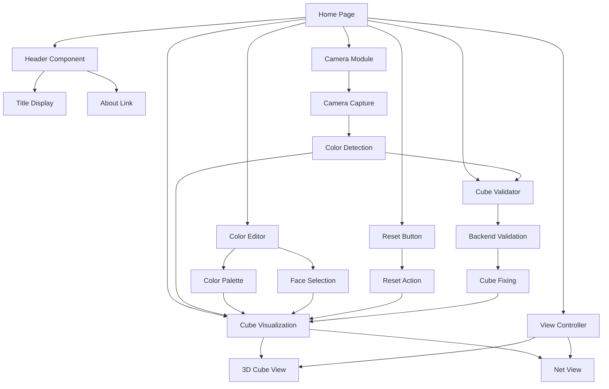

# Design Document

## Overview

The Rubik's Cube Home Page is a simple, interactive web application that provides users with a clean interface to visualize and interact with a Rubik's cube. The application features a minimalist design with a header containing a title and about page link, a central cube visualization that can be viewed in both 3D and net formats, camera functionality for cube state capture, and manual color editing capabilities.

The system is designed as a frontend-only single-page application using modern web technologies including HTML5, CSS3, and JavaScript. The cube visualization leverages CSS 3D transforms for the 3D view and CSS Grid for the net layout. Camera functionality uses the WebRTC MediaDevices API for cross-platform camera access.

## Architecture

### High-Level Architecture



### Technology Stack

- **Frontend Framework**: Vanilla JavaScript (ES6+)
- **Styling**: CSS3 with CSS Grid, Flexbox, and 3D Transforms
- **Camera Access**: WebRTC MediaDevices API
- **Image Processing**: HTML5 Canvas API
- **3D Visualization**: CSS 3D Transforms
- **Build Tools**: None (direct browser execution)
- **Responsive Design**: CSS Media Queries

### Module Structure

```
src/
├── index.html
├── about.html
├── styles/
│   ├── main.css
│   ├── cube.css
│   ├── camera.css
│   └── responsive.css
├── scripts/
│   ├── main.js
│   ├── cube-renderer.js
│   ├── view-controller.js
│   ├── camera-capture.js
│   ├── color-editor.js
│   ├── cube-state.js
│   ├── cube-validator.js
│   └── reset-button.js
└── assets/
    ├── images/
    └── icons/
```

## Components and Interfaces

### 1. Header Component

**Purpose**: Simple header with title and navigation to about page.

**Key Elements**:
- Application title
- About page link
- Clean, minimal styling

**Interface**:
```javascript
class Header {
  constructor()
  render()
  handleAboutClick()
}
```

### 2. Cube Renderer Component

**Purpose**: Handles the visual representation of the Rubik's cube in both 3D and net views.

**Key Features**:
- 3D cube visualization using CSS transforms
- Net (flattened) layout using CSS Grid
- Smooth transitions between views
- Interactive face selection for color editing

**Interface**:
```javascript
class CubeRenderer {
  constructor(containerId, cubeState)
  render3DView()
  renderNetView()
  updateFaceColors(faceIndex, colors)
  highlightFace(faceIndex)
  enableInteraction()
}
```

### 3. View Controller Component

**Purpose**: Manages switching between 3D model and net views.

**Key Features**:
- View toggle buttons
- Smooth view transitions
- State preservation across view changes
- Responsive view adaptation

**Interface**:
```javascript
class ViewController {
  constructor(cubeRenderer)
  switchTo3D()
  switchToNet()
  getCurrentView()
  addViewChangeListener(callback)
}
```

### 4. Camera Capture Component

**Purpose**: Handles camera access and cube state capture from images.

**Key Features**:
- Camera permission handling
- Image capture interface
- Basic color detection from captured images
- Integration with cube state

**Interface**:
```javascript
class CameraCapture {
  constructor(cubeState)
  async requestCameraAccess()
  openCameraInterface()
  captureImage()
  processImage(imageData)
  closeCamera()
}
```

### 5. Color Editor Component

**Purpose**: Provides manual color editing functionality for cube faces.

**Key Features**:
- Color palette with standard Rubik's cube colors
- Face and sticker selection
- Real-time color updates
- Undo/redo functionality

**Interface**:
```javascript
class ColorEditor {
  constructor(cubeState, cubeRenderer)
  showColorPalette()
  selectColor(color)
  selectFaceSticker(faceIndex, stickerIndex)
  updateColor()
  enableEditMode()
  disableEditMode()
}
```

### 6. Cube State Manager

**Purpose**: Manages the overall state of the cube including colors and configuration.

**Key Features**:
- Cube state storage and retrieval
- Color validation
- State change notifications
- Persistence across sessions

**Interface**:
```javascript
class CubeState {
  constructor()
  getFaceColors(faceIndex)
  setFaceColors(faceIndex, colors)
  setStickerColor(faceIndex, stickerIndex, color)
  isValidState()
  reset()
  addChangeListener(callback)
}
```

### 7. Reset Button Component

**Purpose**: Provides a user-accessible reset functionality to return the cube to its solved state.

**Key Features**:
- Prominent reset button in the interface
- Confirmation of reset action
- Visual feedback on reset completion
- Integration with cube state and renderer

**Interface**:
```javascript
class ResetButton {
  constructor(cubeState, cubeRenderer)
  render()
  handleResetClick()
  showResetConfirmation()
  executeReset()
}
```

### 8. Cube Validator Component

**Purpose**: Validates and fixes cube configurations after camera capture by communicating with backend validation services.

**Key Features**:
- Validate cube button that appears after camera capture
- Backend API integration for cube validation
- Automatic fixing of common cube configuration errors
- User feedback on validation results and corrections made
- Error handling for invalid or unsolvable cube states

**Interface**:
```javascript
class CubeValidator {
  constructor(cubeState, cubeRenderer)
  render()
  showValidateButton()
  hideValidateButton()
  async validateCube()
  async callBackendValidation(cubeData)
  handleValidationResult(result)
  displayValidationFeedback(feedback)
  applyCubeCorrections(correctedState)
}
```

## Data Models

### Cube Face Model
```javascript
{
  position: 'front' | 'back' | 'left' | 'right' | 'top' | 'bottom',
  colors: [
    ['W', 'W', 'W'],  // Top row (3x3 grid)
    ['W', 'W', 'W'],  // Middle row
    ['W', 'W', 'W']   // Bottom row
  ]
}
```

### Cube State Model
```javascript
{
  faces: {
    front: CubeFace,   // White center
    back: CubeFace,    // Yellow center
    left: CubeFace,    // Orange center
    right: CubeFace,   // Red center
    top: CubeFace,     // Green center
    bottom: CubeFace   // Blue center
  },
  currentView: '3d' | 'net',
  editMode: boolean
}
```

### Color Palette Model
```javascript
{
  colors: [
    { name: 'White', code: '#FFFFFF', key: 'W' },
    { name: 'Yellow', code: '#FFFF00', key: 'Y' },
    { name: 'Red', code: '#FF0000', key: 'R' },
    { name: 'Orange', code: '#FFA500', key: 'O' },
    { name: 'Blue', code: '#0000FF', key: 'B' },
    { name: 'Green', code: '#00FF00', key: 'G' }
  ]
}
```

### View Configuration Model
```javascript
{
  view3D: {
    perspective: '1000px',
    rotationX: -15,
    rotationY: 25,
    scale: 1
  },
  viewNet: {
    layout: 'cross',  // Cross-shaped net layout
    spacing: '2px',
    faceSize: '120px'
  }
}
```

### Camera Configuration Model
```javascript
{
  video: {
    width: { ideal: 640 },
    height: { ideal: 480 },
    facingMode: 'environment'
  },
  audio: false,
  captureSettings: {
    imageFormat: 'image/jpeg',
    quality: 0.8
  }
}
```

### Validation Configuration Model
```javascript
{
  backendEndpoint: '/api/validate-cube',
  validationRules: {
    checkSolvability: true,
    fixDuplicateColors: true,
    fixImpossibleConfigurations: true,
    validateColorCount: true
  },
  feedbackMessages: {
    valid: 'Cube configuration is valid and solvable!',
    fixed: 'Cube configuration has been automatically corrected.',
    unfixable: 'Cube configuration contains errors that require manual correction.'
  }
}
```

## Error Handling

### Camera Access Errors

1. **Permission Denied**
   - Display clear message explaining camera functionality
   - Show manual color editing as alternative
   - Provide retry option for camera access

2. **Camera Not Available**
   - Detect if device has no camera capability
   - Hide camera button on devices without camera
   - Focus on manual editing functionality

3. **Camera Access Failed**
   - Handle technical failures gracefully
   - Show error message with retry option
   - Maintain full functionality without camera

### View Rendering Errors

1. **3D Transform Support**
   - Detect browser support for CSS 3D transforms
   - Fallback to 2D representation if needed
   - Maintain functionality across all browsers

2. **Performance Issues**
   - Monitor rendering performance
   - Reduce animation complexity on slower devices
   - Provide simplified view options if needed

### Color Editing Errors

1. **Invalid Color Selection**
   - Validate color choices against cube standards
   - Prevent invalid color combinations
   - Provide visual feedback for corrections

2. **State Corruption**
   - Validate cube state integrity
   - Provide reset functionality
   - Maintain backup of previous valid state

### Cube Validation Errors

1. **Backend Communication Failures**
   - Handle network connectivity issues gracefully
   - Provide retry mechanism for failed validation requests
   - Show appropriate error messages when backend is unavailable
   - Maintain cube functionality even when validation fails

2. **Invalid Cube Configurations**
   - Handle cases where cube cannot be automatically fixed
   - Provide specific feedback about what errors were found
   - Guide user toward manual corrections when needed
   - Preserve original state when validation fails

3. **Validation Timeout**
   - Set reasonable timeout limits for backend validation calls
   - Provide user feedback during long validation processes
   - Allow user to cancel validation if it takes too long

### Responsive Design Errors

1. **Small Screen Handling**
   - Adapt cube size for mobile devices
   - Ensure touch targets are appropriately sized
   - Maintain usability on all screen sizes

2. **Orientation Changes**
   - Handle device rotation gracefully
   - Maintain cube state during orientation changes
   - Adjust layout for landscape/portrait modes

## Testing Strategy

### Unit Testing

1. **Cube Rendering**
   - Test 3D view generation with CSS transforms
   - Validate net view layout with CSS Grid
   - Test color updates and visual feedback

2. **View Controller**
   - Test view switching functionality
   - Validate state preservation across views
   - Test responsive behavior on different screen sizes

3. **Color Editor**
   - Test color selection and application
   - Validate face and sticker selection logic
   - Test undo/redo functionality

4. **State Management**
   - Test cube state initialization and updates
   - Validate color change notifications
   - Test state persistence and retrieval

5. **Cube Validation**
   - Test backend API communication for validation requests
   - Validate cube state correction algorithms
   - Test error handling for invalid cube configurations
   - Test user feedback display for validation results

### Integration Testing

1. **Component Interaction**
   - Test communication between cube renderer and color editor
   - Validate view controller integration with renderer
   - Test camera integration with cube state

2. **Cross-Browser Compatibility**
   - Test CSS 3D transform support across browsers
   - Validate camera API functionality
   - Test responsive design on different devices
   - Test backend API integration across different browsers

3. **Performance Testing**
   - Measure rendering performance for both views
   - Test smooth transitions between views
   - Validate touch interaction responsiveness

### User Acceptance Testing

1. **Usability Testing**
   - Test intuitive view switching
   - Validate color editing workflow
   - Test camera capture usability

2. **Visual Testing**
   - Validate cube appearance in both views
   - Test color accuracy and distinction
   - Verify responsive design across devices

3. **Accessibility Testing**
   - Test keyboard navigation support
   - Validate screen reader compatibility
   - Test high contrast mode support

## Performance Considerations

### Rendering Optimization

- Use CSS transforms for smooth 3D animations
- Implement efficient DOM updates for color changes
- Minimize reflows and repaints during interactions

### Memory Management

- Clean up camera streams when not in use
- Optimize DOM structure for both view types
- Implement efficient event listener management

### Mobile Optimization

- Optimize touch targets for mobile devices
- Implement proper viewport handling
- Consider device orientation changes
- Optimize for various screen densities

### Loading Performance

- Minimize initial CSS and JavaScript bundle size
- Use efficient CSS selectors and animations
- Implement progressive enhancement for advanced features